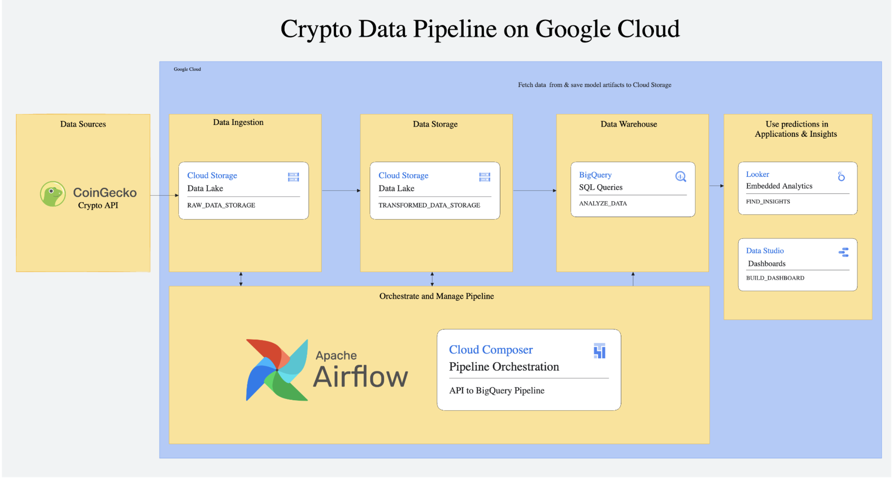
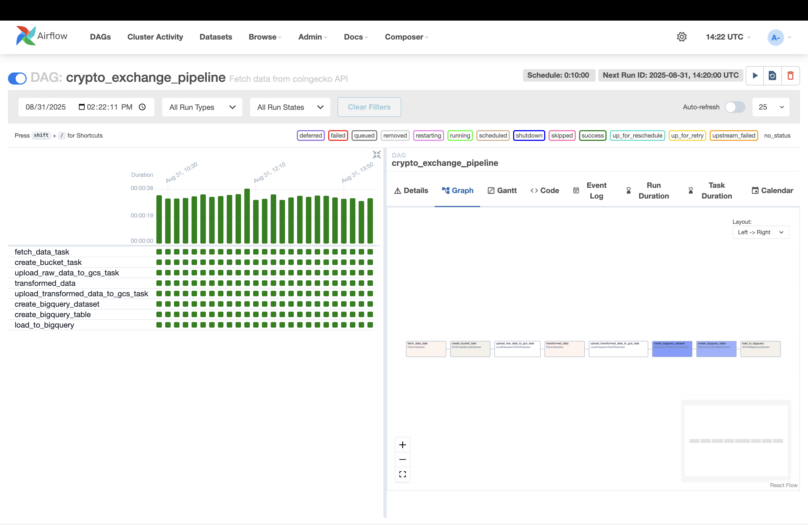
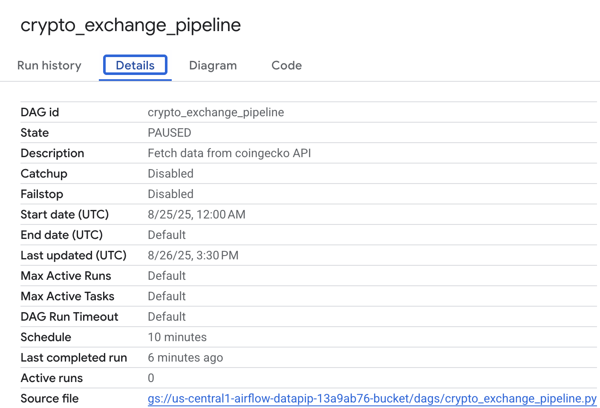
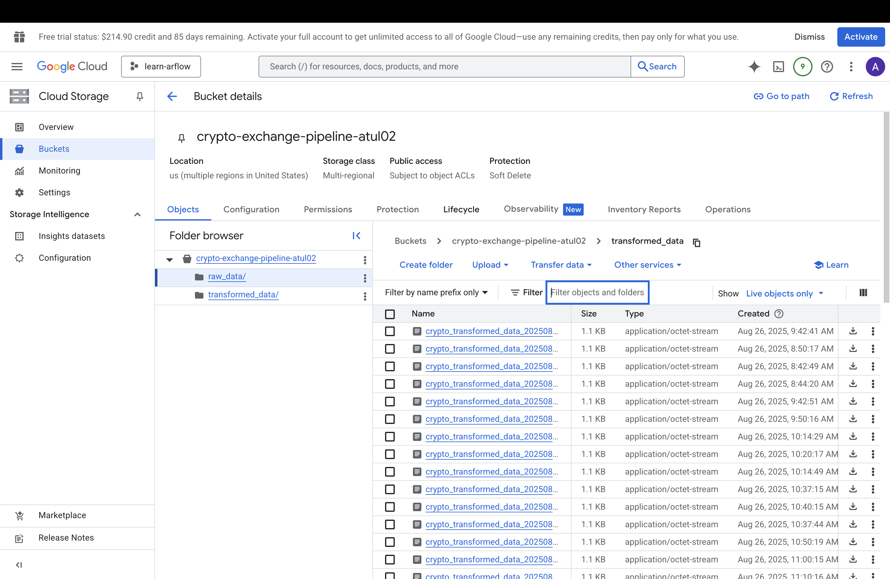

# Crypto Data Pipeline on Google Cloud


## Overview
This project implements a **production-ready cryptocurrency data pipeline** that fetches real-time market data from CoinGecko API and processes it through Google Cloud services using **Apache Airflow orchestration** and **ELT architecture**.

---

## Motivation
The primary goal was to design and implement an **enterprise-grade data pipeline** for cryptocurrency analytics using **Google Cloud Platform, Apache Airflow, and BigQuery**.

It demonstrates how **real-time financial data** can be ingested, transformed, and delivered as **analytics-ready insights** in an automated, scalable, and cost-efficient way.

The project reflects **end-to-end data engineering thinking** from API integration, cloud orchestration, to advanced financial analytics - simulating real-world fintech data workflows.

---

## Data Source
- **CoinGecko API** - Real-time cryptocurrency market data
- **Update Frequency**: Every 10 minutes for top 10 cryptocurrencies
- **Data Points**: Price, market cap, volume, metadata
- **Storage Format**: JSON (raw) → CSV (transformed) → BigQuery tables

---

## Architecture



**Data Flow**: CoinGecko API → Cloud Storage → BigQuery → Analytics

**Technology Stack**:
- **Data Ingestion**: Apache Airflow with PythonOperator for API calls
- **Storage**: Cloud Storage buckets (raw_data/, transformed_data/)  
- **Processing**: Local transformation with pandas DataFrame operations
- **Warehouse**: BigQuery with optimized schema and partitioning
- **Orchestration**: Cloud Composer (managed Airflow) for production scheduling

---

## 🔄 Workflow Overview

### 1. Data Ingestion
- **Source**: CoinGecko REST API (top 10 cryptocurrencies by market cap)
- **Frequency**: Automated every 10 minutes
- **Raw Storage**: Cloud Storage data lake in JSON format
- **Error Handling**: Request retries and validation

### 2. Data Transformation
- **Process**: JSON → structured CSV with metadata
- **Enhancements**: 
  - Pipeline timestamps for data lineage
  - Data type standardization
  - Field validation and cleansing
- **Storage**: Separate GCS bucket for processed data

### 3. Data Warehouse Loading
- **Target**: BigQuery optimized tables
- **Schema**: Strongly-typed with proper constraints
- **Strategy**: Append-only for historical analysis
- **Performance**: Partitioned and optimized for analytics

### 4. Analytics Layer
Advanced financial metrics and analysis:
- **Price Tracking**: Moving averages and daily returns
- **Risk Analysis**: 30-day annualized volatility using log returns
- **Market Intelligence**: Market cap dominance calculations  
- **Correlation Studies**: Cross-asset relationship analysis (BTC vs ETH)

---

## Key Features

### Pipeline Orchestration
- **Apache Airflow DAG** with complex task dependencies
- **Google Cloud Operators**: Seamless GCP service integration
- **Error Handling**: Robust failure recovery and alerting
- **Scheduling**: Automated 10-minute intervals with backfill support

### Cloud Architecture  
- **Cloud Storage Data Lake**: Raw and transformed data zones
- **BigQuery Data Warehouse**: Optimized for analytical workloads
- **IAM Security**: Service account authentication and least-privilege access
- **Resource Management**: Automated bucket and dataset provisioning

### Advanced Analytics
```sql
-- 30-day Annualized Volatility Analysis
SELECT symbol, 
       STDDEV_SAMP(log_ret) * SQRT(365) AS ann_vol_30d
FROM daily_returns 
WHERE date >= DATE_SUB(CURRENT_DATE(), INTERVAL 30 DAY)
ORDER BY ann_vol_30d DESC;

-- BTC-ETH Correlation Analysis  
SELECT CORR(btc_returns, eth_returns) AS correlation_90d
FROM crypto_returns
WHERE date >= DATE_SUB(CURRENT_DATE(), INTERVAL 90 DAY);
```

---

## 🚀 Deployment Journey

### Local Development
Initially developed and tested using:
- **Apache Airflow** standalone installation
- **Local Python environment** with GCP SDK
- **Service account authentication** for cloud services



### Production Deployment  
Migrated to **Google Cloud Composer** for enterprise production:
- **Managed Airflow** eliminates infrastructure overhead
- **Auto-scaling** handles variable workloads
- **Integrated monitoring** with Cloud Logging and Monitoring
- **High availability** with automatic failover



---

## 📷 Pipeline Execution

### Pipeline Execution Steps
1. **fetch_data_task** - Retrieve cryptocurrency data from CoinGecko API
2. **create_bucket_task** - Provision Cloud Storage bucket for data lake
3. **upload_raw_data_to_gcs_task** - Store raw JSON data in GCS
4. **transformed_data_task** - Convert JSON to structured CSV format  
5. **upload_transformed_data_to_gcs_task** - Store processed data in GCS
6. **create_bigquery_dataset_task** - Provision BigQuery dataset
7. **create_bigquery_table_task** - Create table with defined schema
8. **load_to_bigquery** - Load transformed data into BigQuery warehouse

### Successful DAG Runs


### Data Storage Results
Consistent data collection with proper file organization:



---

## 📁 Project Structure

```
crypto-data-pipeline/
├── .github/                      # GitHub workflows and templates  
├── dags/                         # Airflow DAGs directory
│   ├── crypto_exchange_pipeline.py  # Main pipeline DAG
│   └── .gitkeep                  
├── docs/                         # Project documentation
│   └── .gitkeep                  
├── images/                       # Architecture diagrams and screenshots
│   └── .gitkeep                  
├── sql/                          # SQL queries and analytics  
│   ├── analytical_queries.sql    # BigQuery financial analytics
│   └── .gitkeep                  
└── README.md                     # Project documentation
```

---

## 🔧 Technical Implementation

### Airflow DAG Components
```python
# Key operators and integrations used:
from airflow.operators.python_operator import PythonOperator
from airflow.providers.google.cloud.operators.gcs import GCSCreateBucketOperator  
from airflow.providers.google.cloud.transfers.local_to_gcs import LocalFilesystemToGCSOperator
from airflow.providers.google.cloud.transfers.gcs_to_bigquery import GCSToBigQueryOperator
from airflow.providers.google.cloud.operators.bigquery import BigQueryCreateEmptyDatasetOperator
```

### BigQuery Schema Design
```python
BQ_SCHEMA = [
    {"name": "id", "type": "STRING", "mode": "REQUIRED"},
    {"name": "symbol", "type": "STRING", "mode": "REQUIRED"}, 
    {"name": "current_price", "type": "FLOAT", "mode": "NULLABLE"},
    {"name": "market_cap", "type": "FLOAT", "mode": "NULLABLE"},
    {"name": "total_volume", "type": "FLOAT", "mode": "NULLABLE"},
    {"name": "last_updated", "type": "TIMESTAMP", "mode": "NULLABLE"},
    {"name": "timestamp", "type": "TIMESTAMP", "mode": "REQUIRED"}
]
```

### Data Transformation Logic
```python
def _transform_data():
    """Transform raw JSON data to structured CSV format"""
    with open("crypto_data.json", 'r') as f:
        data = json.load(f)

    transformed_data = []
    for item in data:
        transformed_data.append({
            'id': item['id'],
            'symbol': item['symbol'], 
            'name': item['name'],
            'current_price': item['current_price'],
            'market_cap': item['market_cap'],
            'total_volume': item['total_volume'],
            'last_updated': item['last_updated'],
            'timestamp': datetime.utcnow().isoformat()  # Pipeline metadata
        })

    df = pd.DataFrame(transformed_data)
    df.to_csv("transformed_data.csv", index=False)
```

---

## 💡 Technical Achievements

**Airflow Implementation**:
- Multi-task DAG orchestration with proper dependencies
- Proper operator selection for cloud-native workflows  
- Dynamic file naming with Airflow macros (`{{ ts_nodash }}`)
- Task dependency management and error propagation

**Google Cloud Integration**:
- Integrated pipeline using GCS, BigQuery, and Cloud Composer
- Proper service account configuration and IAM permissions
- Resource provisioning automation
- Cost optimization through proper resource lifecycle

**Financial Data Engineering**:
- Real-time API integration with error handling
- Time-series data modeling and storage
- Advanced volatility and correlation calculations
- Historical data preservation for trend analysis

---

## 📊 Business Impact

- **Real-time Monitoring**: Track cryptocurrency market movements every 10 minutes
- **Risk Management**: Calculate volatility metrics for investment decisions
- **Market Intelligence**: Understand dominance patterns and asset correlations  
- **Historical Analysis**: Maintain comprehensive dataset for backtesting and trends

---

## Future Enhancements

- **Multi-Exchange Integration**: Add Binance, Coinbase Pro APIs
- **Real-time Alerting**: Price movement notifications via Cloud Functions
- **Machine Learning**: Price prediction models using Vertex AI
- **Dashboard Integration**: Google Data Studio or Looker visualizations
- **Stream Processing**: Real-time analytics with Dataflow

---

## Deployment Guide

### Prerequisites
- Google Cloud Project with billing enabled
- Service account with appropriate IAM roles
- Cloud Composer environment (or local Airflow)
- BigQuery API enabled

### Setup Steps
1. **Provision GCP Resources**: Storage buckets, BigQuery dataset
2. **Configure Service Account**: Download credentials JSON
3. **Deploy Airflow DAG**: Upload to Cloud Composer or local environment  
4. **Test Pipeline**: Trigger manual run and verify data flow
5. **Enable Scheduling**: Activate 10-minute interval execution

---

## Conclusion

This project demonstrates the design and implementation of a **production-ready financial data pipeline** using Google Cloud Platform, Apache Airflow, and modern data engineering practices.

It showcases **end-to-end data engineering capabilities** from API integration and cloud orchestration to advanced financial analytics, delivering **real-time insights** for cryptocurrency market analysis.

The pipeline handles **automated data collection, transformation, and analytics** while ensuring **reliability, scalability, and cost-effectiveness** through proper cloud architecture and monitoring.

This work reflects my ability to:
- **Architect scalable cloud data pipelines** with proper service integration  
- **Implement complex Airflow orchestration** with error handling and monitoring
- **Design analytics-ready data models** for financial time-series analysis
- **Bridge engineering and analytics** to deliver actionable business insights

The foundation supports easy **extensibility for additional data sources, advanced analytics, and downstream applications**, making it adaptable for **enterprise fintech requirements** and evolving market data needs.

---

*Built with Apache Airflow and Google Cloud Platform*
